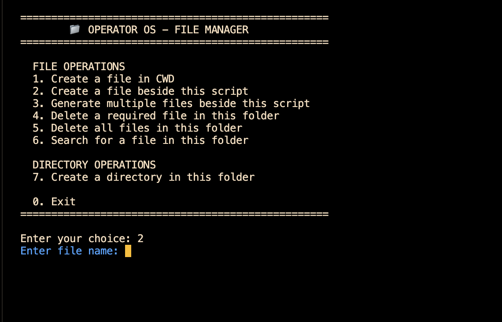

# 🖥️ Operator OS

> A lightweight Python-based file management utility built to explore filesystem operations, Python modules, and OS-level interaction.

---

## 📸 Demo

---

## 📌 About

**Operator OS** is a Python-based command-line file management utility created as a hands-on project for learning how Python interacts with the operating system and filesystem.

The program provides an interactive menu for performing common file and directory operations such as creating files, deleting files, searching for files, generating multiple files, and creating directories.

The goal of the project is not to replicate a complete operating system, but to build a practical understanding of Python's filesystem capabilities through a real working project.

---

## ✨ Features

### 📄 File Operations

- Create a file in the Current Working Directory
- Create a file inside the Operator OS managed folder
- Automatically generate multiple sample files
- Delete a specific file
- Delete all managed files
- Search for files and directories
- Identify whether a searched item is a file or directory

### 📁 Directory Operations

- Create directories inside the managed folder
- Inspect directory contents
- Work with filesystem paths

### 🖥️ CLI Experience

- Interactive terminal menu
- ANSI-colored terminal output
- Loading animations using `tqdm`
- Confirmation before destructive operations
- Clear success and error messages
- Display of generated file paths

---

## 🛠️ Technologies & Modules

### Python Standard Library

| Module | Purpose |
|---|---|
| `os` | Filesystem and operating-system interaction |
| `sys` | Program termination |
| `time` | Timing and delays |

### Third-Party Module

| Module | Purpose |
|---|---|
| `tqdm` | Terminal progress bars and loading animations |

---

## 🧠 Concepts Practiced

This project helped practice:

- Python modules and imports
- Python Standard Library
- Third-party Python packages
- Functions
- Loops
- Conditional statements
- User input
- File handling
- Directory handling
- Current Working Directory
- Script location
- Absolute and relative paths
- Filesystem path construction
- File existence checking
- File and directory detection
- File creation
- File deletion
- Directory creation
- Directory listing
- ANSI terminal colors
- Command-line interfaces

---

## 🔧 Important `os` Functions Used

### Get the Current Working Directory

    os.getcwd()

### Get the Location of the Current Python Script

    os.path.dirname(__file__)

### Build Filesystem Paths

    os.path.join(folder, filename)

### Check Whether a Path Exists

    os.path.exists(path)

### Check Whether a Path Is a File

    os.path.isfile(path)

### List Directory Contents

    os.listdir(directory)

### Create a Directory

    os.mkdir(path)

### Delete a File

    os.remove(path)

---

## 📂 Project Structure

    operator-os/
    │
    ├── operator_os.py
    ├── demopic5.png
    └── README.md

The program is designed around a dedicated managed directory:

    Current Working Directory/
    │
    └── my file os operator/
        │
        ├── operator_os.py
        ├── generated files...
        └── generated directories...

---

## 🚀 Installation & Setup

### 1. Clone the Repository

    git clone https://github.com/YOUR-USERNAME/operator-os.git

### 2. Enter the Project Directory

    cd operator-os

### 3. Install `tqdm`

    pip install tqdm

Or:

    pip3 install tqdm

### 4. Run Operator OS

    python3 operator_os.py

---

## 🎮 Current Menu

    ==================================================
            📁 OPERATOR OS - FILE MANAGER
    ==================================================

      FILE OPERATIONS
      1. Create a file in CWD
      2. Create a file beside this script
      3. Generate multiple files beside this script
      4. Delete a required file in this folder
      5. Delete all files in this folder
      6. Search for a file in this folder

      DIRECTORY OPERATIONS
      7. Create a directory in this folder

      0. Exit

    ==================================================

---

## ⚙️ How It Works

Operator OS uses Python's `os` module to communicate with the filesystem.

For example, a file path can be constructed using:

    path = os.path.join(folder, filename)

The program can then check whether the requested path exists:

    os.path.exists(path)

It can distinguish between files and directories:

    os.path.isfile(path)
    os.path.isdir(path)

Directory contents can be retrieved using:

    os.listdir(directory)

Files and directories can then be manipulated using operations such as:

    os.remove(path)
    os.mkdir(path)

This makes Operator OS a practical introduction to filesystem programming in Python.

---

## ⚠️ Safety Notice

Operator OS performs **real filesystem operations**.

For example:

    os.remove(path)

can permanently delete a file.

The program should therefore be used inside a dedicated test/project directory and should not be pointed at important system directories or personal data.

---

## 📈 Future Improvements

The project can be expanded with:

- [ ] Rename files
- [ ] Move files
- [ ] Copy files
- [ ] Display file sizes
- [ ] Display file extensions
- [ ] File metadata viewer
- [ ] Directory size calculation
- [ ] Search by file extension
- [ ] Search by partial filename
- [ ] Recursive directory search
- [ ] Better exception handling
- [ ] Safer deletion confirmation
- [ ] File preview
- [ ] `pathlib` support
- [ ] Separate modules for different operations
- [ ] Configuration system
- [ ] More advanced CLI interface

---

## 🎯 Learning Objective

Operator OS was built as a practical way to move beyond basic Python syntax and start interacting directly with the computer's filesystem.

Rather than learning individual functions in isolation, the project combines Python fundamentals with the `os` module to create a functional command-line utility.

---

## 👨‍💻 Author

**Harshvardhan Jha**

Built as a hands-on Python learning project.

---

## 📜 License

This project is available under the MIT License.

Feel free to study, modify, and experiment with the code.

---

⭐ If you found the project interesting, consider giving the repository a star!
